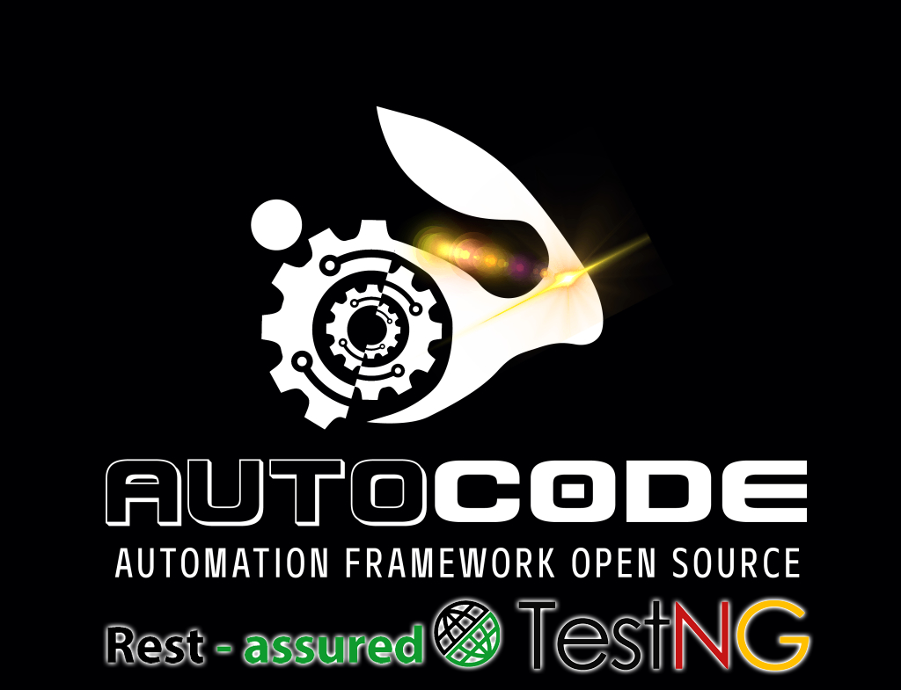
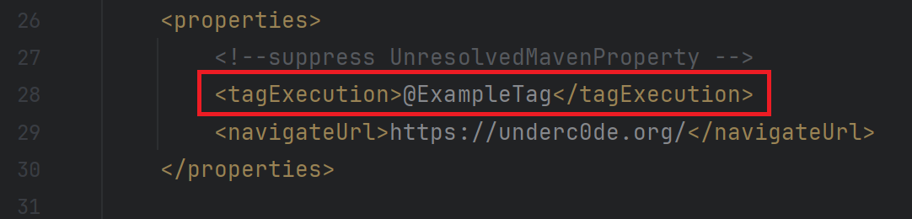
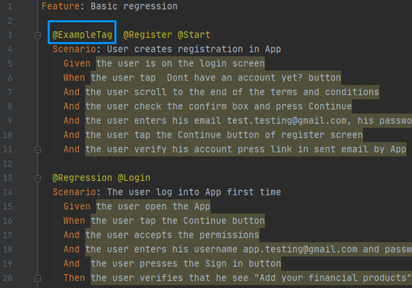
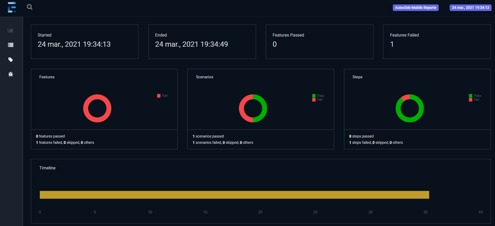
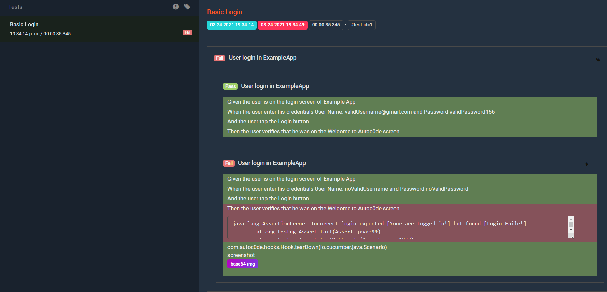
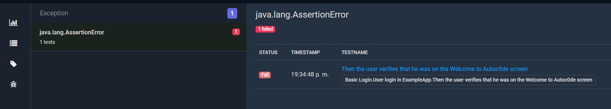
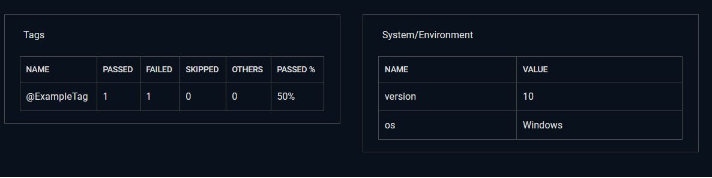
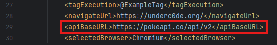
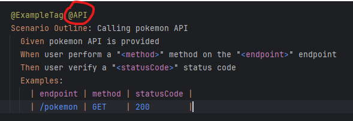

[](https://github.com/underc0delabs/Autoc0de-Hybrid/blob/main/LICENSE)[](https://github.com/underc0delabs/Autoc0de-Hybrid/actions/workflows/Tests.yml)


# Autoc0de API TestNG - Automation API Framework



## _Open source tests automation framework API with TestNG and Rest Assured_

# Indices

In this README.MD we will see the following topics:

- What can we do with this Framework
- What technologies are incorporated (Technological Stack)
- Project architecture
- Tools needed to run it locally and Steps to run the Framework
- How to change the suite to be run
- How to see a great Report

## What can we do with this Framework

- Add playable code for APIs apps
- Automate in **BDD** using **Gherkin** language
- Obtain at the end of each execution, two types of reports **(ExtentReports)**
- Use the framework's own functions to streamline repetitive tasks
- Execution **Sequential**
- Execution **Parallel**
- Add your suite @tags from the **pom.xml** file
- Easy integration on CD-CI systems

This framework is made based on several technologies that are detailed in the next point. All open source

## Technological Stack

This Framework includes the following technologies:

- [Maven] - Java project management and construction tool (latest)
- [Java] - OO programming language. (JDK latest)
- [Rest Assured] - Automation API tool using BDD (latest)
- [Cucumber] - Tool that allows us to generate test scripts using test cases written in Gherkin **(Files.feature)**. (latest)
- [Gherkin] - Communication language model that allows us to work with BDD methodology
- [Extent Report] - Intuitive reporter and very nice to look at.
- [TestNG] - Automation tool that will allow us to create Runners and use notations.

**IDE recommended**
- [IntelliJ] - Excellent Ide for automation development (Latest)

**Recommended plugins for IntelliJ**
- **Gherkin**
- **Cucumber for Java**

The technologies mentioned above are integrated into the framework through MAVEN in the **pom.xml** file. The versions are specified below:

| Technology                      | Maven version | Link Maven repo                                                                     |
|---------------------------------|---------------|-------------------------------------------------------------------------------------|
| TestNG maven                    | 7.10.2        | https://mvnrepository.com/artifact/org.testng/testng                                |
| Cucumber-java                   | 7.15.0        | https://mvnrepository.com/artifact/io.cucumber/cucumber-java                        |
| Cucumber-core                   | 7.15.0        | https://mvnrepository.com/artifact/io.cucumber/cucumber-core                        |
| Assertj-core                    | 3.26.3        | https://mvnrepository.com/artifact/org.assertj/assertj-core                         |
| SLF4J LOG4J 12                  | 2.0.13        | https://mvnrepository.com/artifact/org.slf4j/slf4j-log4j12                          |
| SLF4J API                       | 2.0.13        | https://mvnrepository.com/artifact/org.slf4j/slf4j-api                              |
| Rest Assured                    | 5.5.0         | https://mvnrepository.com/artifact/io.rest-assured/rest-assured                     |
| Commons Configurations          | 1.10          | https://mvnrepository.com/artifact/commons-configuration/commons-configuration      |
| Json                            | 20240303      | https://mvnrepository.com/artifact/org.json/json                                    |
| ExtentReports Cucumber7 Adapter | 1.14.0        | https://mvnrepository.com/artifact/tech.grasshopper/extentreports-cucumber7-adapter |

**Remember to keep these versions of Maven up to date as much as possible. If the project ever stops working, it could be because one of the versions found here has been deprecated / moved. However, it must be remembered that at the date this project was uploaded, all versions are the most current**

## Framework architecture

This Framework uses the automation pattern [Page Object Model] and is structured as follows.


```
   
└── src
    ├── main
    │   └── java 
    │   
    └── test
    │   ├── java   
    │   │   └── com.autoc0de
    │   │       ├── runner
    │   │       |   ├── TestRunner.java -----------------> Runner for execute in sequential mode the tests suites with TestNG
    │   │       |   └── TestRunnerParallel.java ---------> Runner for execute in parallel mode the tests suites with TestNG
    │   │       └── steps -------------------------------> Folder where our step definitions are stored 
    │   │           └── ExampleAPISteps.java ---------------> Example of a API step  
    │   └── resources           
    │       ├── features --------------------------------> Folder where out features files are stored
    │       │   └── ExampleAPI.features -----------------> Example of a API feature file
    │       ├── extent.properties -----------------------> Report properties
    │       └── extent-config.xml -----------------------> Report config
    ├── pom.xml -----------------------------------------> POM File of this framework 
    ├── testng-parallel.xml -----------------------------> Runner configuration to run test cases in parallel mode
    └── testng-sequential.xml ---------------------------> Runner configuration to run test cases in sequential mode

```

This pattern is based on 2 levels:

* **Step definitions** (They are all the definitions of our steps written in [Gherkin] and your API request and responses, in this case, in the folder ```steps```)
* **Features** (These are all our .features files written in [Gherkin], in this case, in the folder ```features```)
* 
## Tools needed to run it locally and Steps to run the Framework

In the ```Technological Stack``` section, we will find links that will take us to the websites to download all the tools we need. However, when using maven, we only need to install:
* Maven 3.9.1 minimal (The latest work fine too)
* Java JDK 22 from Oracle (The latest version will work fine too)

1. Install Java and JDK
2. Install Maven
3. Expose Maven and Java in environment variables (M2_HOME and JAVA_HOME)
4. Inside the root path of the newly cloned project, open the console and execute the following maven command: ```mvn install -DskipTests```. This will download all the necessary dependencies found in the ```pom.xml``` file

  Once we have everything we need installed, to run the project we have 3 options:
  * Inside the project with an ide (IntelliJ for example), select the file ```TestRunner.java```, right click on it, option **"Run"** in order to run it in sequential mode
  * Inside the project with an ide (IntelliJ for example), select the file ```TestRunnerParallel.java```, right click on it, option **"Run"** in order to run it in parallel mode
  * Open console within the path of the newly cloned project and execute the following maven command ```mvn clean tests```
  
  At this time we should be running the automatic tests on Google Chrome browser (Chromium)

5. When the execution finishes, we go to the folder ```target/Reports``` where we will find the ExtentReport report called``` ExtentReport-HTML.html``` and ```index.html```
6. Finally, if we wish, we execute the maven command ```mvn clean``` to delete the folder ```target``` and all its content

## Maven Profiles

We have the possibility of executing our project using different Maven profiles to obtain specific results. The existing ones, their function and an example are detailed below.


| Maven Profile         | Description                  | Example Maven Command |
|-----------------------|------------------------------|-----------------------|
| Sequential            | Run suite in sequential mode | mvn test -PSequential |
| Parallel              | Run suite in parallel mode   | mvn test -PParallel   |


## How to change the Suite that is going to be executed

To change the scenario we want to run, we have to modify the ```@Tag``` of [Cucumber] in the file ```pom.xml``` at ```27 code line``` indicated in the following images:

```File Pom.xml```

<p align="center">
  
</p>

Remember that the ```@tag``` that we are going to replace has to be identical in both files, and it has to exist within the feature that we want to execute, for example:

```File Example.feature```

<p align="center">
  
</p>

## How to see a great Report

If we want to see the report, prior to the execution of the project, we have to go to the ```Target``` folder that is automatically generated in the project structure.

```
  
└── src
└── Target
    ├── cucumber-reports -------------------> In this folder we found a basic cucumber report
    ├── generated-test-sources
    └── Reports ----------------------------> in this folder we found 2 type of reports 
    │   ├── ExtentReport-HTML.html ---------> Greater report of Extent Report
    │   └── index.html ---------------------> Greater report of Extent Report
    └── test-clases
```

It is as simple as looking for it, opening it with a browser and viewing it

* Extra Feature:
  * **Screenshots**: If in our test we have errors, the framework will automatically generate a screenshot at the exact moment the execution failed.

  Examples:
<p align="center">
Example of dashboard of our Report
</p>
<p align="center">
  
</p>
<p align="center">
Example of status of our steps
</p>
<p align="center">
  
</p>
<p align="center">
Example of an exception captured by the report
</p>
<p align="center">
  
</p>
<p align="center">
Example of the environment and system information
</p>
<p align="center">
  
</p>

## How to configure Autoc0de for your API application

1. Open the ```pom.xml``` file that is in the root of the project, then, look for its property called ```<apiBaseURL>https://pokeapi.co/api/v2</apiBaseURL>``` in the ```28 code line``` and replace that address with that of your API application

<p align="center">
  
</p>

2. Now, add your features files in the folder ```features```, your step definition and necessary methods in the folder ```steps```

<p align="center">
  
</p>

3. Add the @tag that you want to execute in the **pom.xml** file. In the ```27 code line``` and in the ```feature.file``` that you want.
4. Done!, now run on a terminal the command: ```mvn clean test``` (Or click on ```TestRunner.class``` ---> ```run```) and your project was run!


# Enjoy!

## Architect, creator and developer of the framework
```sd
    * Joel Vitelli
```
## Distributed by
```sd
    * Underc0de.org
```

## Contributing Developers
```sd
    * Danilo Vezzoni    
```


[Maven]: <https://maven.apache.org/download.cgi>
[Java]: <https://www.oracle.com/java/technologies/javase/jdk20-archive-downloads.html>
[Cucumber]: <https://cucumber.io/>
[Gherkin]: <https://cucumber.io/docs/gherkin/reference/>
[Extent Report]: <https://www.extentreports.com/>
[TestNG]: <https://testng.org//>
[Rest Assured]: <https://rest-assured.io/>
[IntelliJ]: <https://www.jetbrains.com/idea/>
[Page Object Model]: <https://www.selenium.dev/documentation/test_practices/encouraged/page_object_models/>

## 🚀 About Me
I'm a full stack automation developer. I love support the community and create new tools for automation!


## 🔗 Links
[](https://github.com/Joel-Vitelli)
[](https://www.linkedin.com/in/joel-vitelli/)


